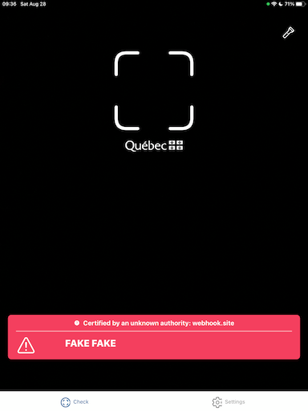
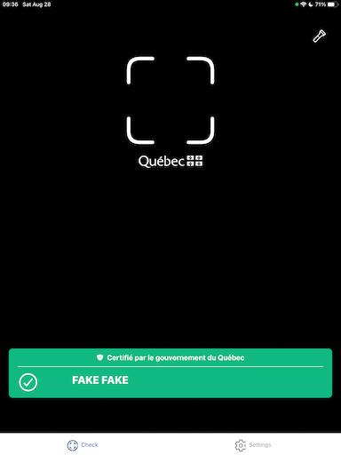

# Analyse sur la faille de l’application VaxiCode Verif

## Contexte

[Lors d’un point de presse mardi 10 août dernier][1], le ministre de la Santé et des Services sociaux Christian Dubé a
annoncé la mise en place du [passeport vaccinal][2] à partir du 1er septembre pour toutes les activités non essentielles
prenant place dans des lieux publics. Le passeport vaccinal fonctionne à l’aide des codes QR (aussi appelé [preuve de
vaccination ou preuve vaccinale][3]) que le Ministère de la Santé et des Services sociaux du Québec (MSSS) a commencé
à délivrer aux citoyens le printemps dernier.

Ces codes QR suivent le [standard _SMART Health Cards_][4] (SHC), que l’on pourrait traduire par _Cartes santés
intelligentes_. Les codes QR SHC contiennent le nom et la date de naissance du citoyen et les informations relatives aux
doses de vaccins reçues. Toutes ces informations sont signées à l’aide d’une clé cryptographique de l’entité qui émet le
code QR, dans ce cas-ci, la clé du MSSS. Cette clé cryptographique permet à quiconque qui lit le code QR de valider que
le contenu n’a pas été altéré (intégrité) et qu’il a bien été émis par le MSSS (authenticité).

[Lors d’un point de presse mardi 24 août][5], le ministre Christian Dubé a annoncé que deux applications, soit VaxiCode
et VaxiCode Verif, seraient publiées dans les prochains jours. La première application, que l’on va appeler application
portefeuille (de l’anglais _wallet_), sert aux citoyens à y stocker leurs codes QR. Son utilisation est facultative
et seulement pour plus de commodité. La seconde application, que l’on va appeler application lecteur (de l’anglais
_reader_), sert aux commerçants à lire et valider les codes QR de leur clientèle. Les deux applications conçues par
la firme [Akinox Solutions][6] ont été publiées sur l’App Store d’Apple tôt le matin du mercredi 25 août.

[Dans la matinée du vendredi 27 août][7], Radio-Canada rapportait qu’un informaticien avait réussi en six heures
seulement à créer de faux codes QR valides. Ces codes QR ont été validés par Radio-Canada à l’aide de l’application
VaxiCode Verif. L’article ne précise pas comment l’informaticien a réussi à déjouer le processus de validation, ni même
où se situent la ou les vulnérabilités dans le processus.

## Scénario

Voici un scénario plausible qui illustre le déroulement de l’exploit dans une situation fictive. Il est important de
noter que ce scénario et l’exploit décrit ci-dessous n’est pas nécessairement le même que celui montré Radio-Canada et
trouvé par l’informaticien.

Kevin se présente à son restaurant préféré avec ses amis. Kelvin présente son téléphone avec l’application VaxiCode à
l’hôtesse du restaurant. L’hôtesse fait la lecture du code QR avec l’application VaxiCode Verif, mais celui-ci est
refusé et affiche un message d’erreur. Kevin s’excuse, se met de côté et laisse passer ses amis avant lui. Alors,
l’hôtesse fait la lecture des codes QR de tous les amis de Kevin et tous sont validés avec succès. Finalement, Kevin
présente son téléphone à nouveau à l’hôtesse, qui fait la lecture du code QR et ce dernier est validé avec succès. Que
s’est-il passé?

## Exploit

Pour réaliser l’exploit, pas un, mais deux codes QR sont nécessaires! Le premier code QR sert à mettre en place la
condition de succès qui va permettre au second code QR d’être validé sans erreur. Ces deux codes doivent donc être lus
par le même appareil et dans le bon ordre. Autrement, s’ils sont lus dans le mauvais ordre ou individuellement, les
codes QR vont afficher un message d’erreur.

### Premier code QR

Normalement, le champ qui identifie l’émetteur du code QR (le champ `iss`, pour _issuer_ en anglais) contient l’URL
`https://covid19.quebec.ca/PreuveVaccinaleApi/issuer`. Tous les codes QR délivrés par le MSSS ont cette même valeur.
Dans le cas du premier code QR, cette adresse est remplacée par une URL valide, contrôlée par l’attaquant. Selon le
standard SHC, cette adresse est utilisée pour aller récupérer les clés publiques de l’émetteur, qui sera utilisé pour
valider la signature des codes QR.

Toujours selon le standard SHC et dans le cas de la librairie utilisée par l’application VaxiCode Verif, lorsque de
nouvelles clés publiques ont été récupérées, elles sont ajoutées au trousseau de clés global. Le trousseau de clés
global est conservé en mémoire tant que l’application est ouverte et n’est pas complètement arrêtée.

Par contre, ce code QR va être refusé par l’application VaxiCode Verif, puisque l’émetteur ne correspond pas à celui
attendu. Dans la logique de l’application, une validation supplémentaire est faite afin de s'assurer que l’hôte dans
l’URL de l’émetteur correspond à `covid19.quebec.ca`.

En résumé, le rôle du premier code QR est d’ajouter une nouvelle clé publique contrôlée par l’attaquant dans le
trousseau de clés global de l’application, même si cela va provoquer un message d’erreur lors de la lecture.

### Second code QR

Dans le cas du second code QR, l’attaquant signe ce code QR avec sa clé cryptographique qui a été ajoutée par le premier
code QR. Mais en ce qui concerne le champ de l’émetteur, l’attaquant utilise l’adresse officielle plutôt qu’une adresse
qu’il contrôle, soit la même qui est normalement utilisée par les codes QR délivrés par le MSSS.

Normalement, l’adresse de l’émetteur est utilisée pour récupérer les clés publiques de l’émetteur, mais dans
l’application VaxiCode Verif, une modification a été faite à la librairie SHC. Lorsque l’adresse de l’émetteur est
`https://covid19.quebec.ca/PreuveVaccinaleApi/issuer`, l’application charge en mémoire la clé publique du MSSS depuis un
fichier contenu dans l’application, pour l’ajouter au trousseau de clés global.

Rendu à l’étape de la validation, puisque le second code QR a été délivré par un émetteur dont l’hôte correspond à
`covid19.quebec.ca` et que le code QR a été signé par une des clés cryptographiques contenues dans le trousseau de clés
global, le second code QR est reconnu comme valide et authentique par l’application.

### Explication du scénario

Kevin a présenté à l’hôtesse deux codes QR différents. Le premier a ajouté sa clé cryptographique au trousseau de clés
global de l’application de l’hôtesse, alors que le second a été signé avec sa clé cryptographique et donc apparaît comme
authentique. À noter que tous les amis de Kevin peuvent très bien avoir eux aussi présenté des codes QR falsifiés avec
la clé cryptographique de Kevin.

## Vulnérabilités

### Trousseau de clés global

La librairie SHC utilisée pour le décodage du code QR et la validation de la signature utilise un trousseau de clés
global à l’application. Aucune association n’est faite entre les émetteurs et les clés dans le trousseau de clés. Sans
cette association, n’importe quelle clé qui est ajoutée au trousseau peut être utilisée lors validation de signature
subséquente. Il s’agit de la première condition qui a permis l’exploit.

### Récupération des clés des émetteurs

La librairie SHC utilisée implémente correctement le standard SHC et va récupérer les clés publiques de l’émetteur.
Cette même librairie permet facilement de désactiver cette fonctionnalité et d’utiliser uniquement des clés qui sont
chargées manuellement. Pour une raison inconnue, Akinox Solutions a pris la décision de ne pas désactiver cette
fonctionnalité. Il s’agit de la seconde condition qui a permis l’exploit.

De plus, le code de la librairie a été modifié pour sauter la récupération des clés publiques de l’émetteur, lorsque
celui-ci est `https://covid19.quebec.ca/PreuveVaccinaleApi/issuer`. La raison de cette modification est certainement
pour permettre une utilisation hors ligne de l’application, mais il s’agit clairement de la mauvaise approche pour y
arriver. Ce faisant, cette même logique permet de contourner la récupération des clés publiques et poursuivre
l’exécution normale du processus de validation du code QR. Il s’agit de la troisième condition qui a permis l’exploit.

## Corrections

[Dans la journée du lundi 30 août][8], une nouvelle version des applications VaxiCode et VaxiCode Verif a été publiée sur
l’App Store d’Apple. Et les applications ont du même coup été rendues disponibles sur le Play Store de Google.

Cette nouvelle version inclut les correctifs nécessaires pour corriger les vulnérabilités et rendre l’exploit
inutilisable. La librairie SHC qui était utilisée a été complètement retirée des applications. Les clés publiques
des émetteurs ne sont plus récupérées. Seule la clé publique du MSSS est chargée manuellement dans l’application. Il
n’est donc plus possible d’importer de nouvelle clé dans l’application et de contourner le processus de validation.

## Réflexions

### Librairie SHC

Il est clair pour moi que la librairie SHC choisie était un mauvais choix. Cette librairie n’est pas assez mature et
robuste pour une utilisation dans une situation réelle. Depuis que l’exploit a été rapporté pour l’application VaxiCode
Verif, une note a été ajoutée au fichier README du projet stipulant que cette librairie n’est pas destinée à valider de
manière robuste les SHC.

> The goal of the project is to help implementers verify that their implementations conform to the specification. It
> optimistically tries to validate as much of the input artefacts as it can, continuing validation after encountering
> errors in order to give a complete validation report. It is therefore _not_ meant to robustly validate actual SMART
> Health Cards; applications validating such cards must be thoroughly tested using an adversarial threat model.

### Choix du standard SHC

J’émets des réserves quant au choix du standard SHC, qui ne semble pas assez mature pour un déploiement comme celui du
passeport vaccinal. Le standard SHC n’a pas prévu de mécanisme robuste pour la validation des identités des émetteurs de
SHC. Un mécanisme similaire aux autorités de certification utilisé pour les certificats SSL serait primordial, surtout
pour permettre la validation de SHC émis par d’autres provinces ou états.

### Code source ouvert

Je crois qu’il serait important, voire nécessaire, de légiférer afin que les applications gouvernementales utilisées par
le grand public aient leur code source ouvert. En ayant un processus plus transparent, plus de personnes intéressées
auraient pu analyser le code des applications et ainsi repérer plus facilement des vulnérabilités trouvées. Les
applications à code source ouvert permettent une meilleure interaction, facilitant les rétroactions et même des
contributions du public. Un code source accessible permet plus de transparence et aide à créer un lien de confiance.

Il est à noter que le gouvernement du Canada a rendu publique l’application Alert COVID dès sa publication. Je crois
qu’il s’agit d’un exemple que Québec aurait dû suivre.

### Canal de divulgation officiel

Le gouvernement du Canada a déjà mis en place un [processus pour rapporter un cyber incident][9]. Malheureusement, le
gouvernement du Québec ne semble pas posséder un tel canal. Il serait important que le gouvernement du Québec mette en
place un processus similaire afin de faciliter la divulgation de vulnérabilité de façon sécuritaire et responsable.

D'ailleurs, un des sujets chauds de la journée du 31 août était à savoir si l’informaticien qui a initialement lancé
l’alerte allait être oui ou non poursuivi en justice. [Radio-Canada rapportait tôt en matinée][10] que Québec avait
refusé de donner l’immunité à l’informaticien et que ce dernier n’était pas à l'abri de poursuite judiciaire. Plus tard
dans cette même journée, le ministre de la Transformation numérique Éric Caire [a contredit l'affirmation en
tweetant][11] qu’« Aucune plainte n’a été déposée [...] » et que « [...] nous souhaitons travailler et collaborer avec
les citoyens responsables et les experts en cybersécurité. »

Dans la même journée, [lors une entrevue en après-midi à l’émission de radio _C'est encore mieux l'après-midi_][12],
Alexis Dorais-Joncas affirmait avoir entendu que le gouvernement du Québec travaillait à la mise en place d’un programme
de divulgation responsable, mais nous voulait pas commenter davantage avant d’avoir vu l’aboutissement de ce projet.
L’entrevue réalisée par Guillaume Dumas portait sur les failles de sécurité de l'application VaxiCode Verif.

Il sera donc intéressant de voir si des changements concrets suivront cette mésaventure. Je me croise les doigts. 🤞

## Liens externes

### Articles

Voici quelques articles et write-ups qui traite du même sujet, en ordre de parution:

* http://len.falken.ink/misc/smart-health-card.txt
* https://www.welivesecurity.com/fr/2021/08/31/faille-preuve-vaccination-quebec-vaxicode-verif/
* https://blog.hackfest.ca/blog/analyse-vulnerabilite-app-vaxicode-verif
* https://blog.oki.moe/2021/08/vaxicode-verif-pas/

### _SMART Health Cards_

Voici quelques liens pratiques (documentations, outils, etc.) sur le standard SHC:

* https://spec.smarthealth.cards/
* https://github.com/fproulx/shc-covid19-decoder
* https://github.com/smart-on-fhir/health-cards-validation-SDK
* https://github.com/cisco/node-jose
* https://github.com/dvci/health-cards-walkthrough/blob/main/SMART%20Health%20Cards.ipynb

### VaxiCode Verif

Voici les liens vers les versions iOS et Android de l'application VaxiCode Verif:

* https://apps.apple.com/fr/app/vaxicode-verif/id1579883180
* https://play.google.com/store/apps/details?id=ca.quebec.vaxilecteurandroid

Ainsi que quelques liens plus techniques pour les curieux:

* https://covid19.quebec.ca/vaxiupdates/vaxi.json
* https://d1wp6m56sqw74a.cloudfront.net/@akinox/vaxi-lecteur/1.0.0/1c2676a609f2b32a0a6be8ce507e9e94-41.0.0-ios.js
* https://d1wp6m56sqw74a.cloudfront.net/@akinox/vaxi-lecteur/1.0.1/b660ef8d0b90d98724d9e2ebd4fb35b2-41.0.0-ios.js
* https://d1wp6m56sqw74a.cloudfront.net/@akinox/vaxi-lecteur/1.0.1/debca98cad287bc578441e14113e02c8-41.0.0-android.js
* https://d1wp6m56sqw74a.cloudfront.net/@akinox/vaxi-lecteur/1.0.3/13914ac73903a4609578277e9cf13947-41.0.0-ios.js
* https://d1wp6m56sqw74a.cloudfront.net/@akinox/vaxi-lecteur/1.0.3/d64aec09c0e8e8c79acc6f55e4bf1639-41.0.0-android.js

<!-- Links -->

[1]: https://ici.radio-canada.ca/nouvelle/1815571/vaccin-passeport-sanitaire-sante-publique-christian-dube-modalites
[2]: https://www.quebec.ca/sante/problemes-de-sante/a-z/coronavirus-2019/deroulement-vaccination-contre-la-covid-19/passeport-de-vaccination-covid-19
[3]: https://www.quebec.ca/sante/problemes-de-sante/a-z/coronavirus-2019/deroulement-vaccination-contre-la-covid-19/preuve-vaccination-covid-19
[4]: https://smarthealth.cards/
[5]: https://ici.radio-canada.ca/nouvelle/1818930/quebec-precision-passeport-vaccinal-code-qr-application
[6]: https://www.akinox.com/fr/
[7]: https://ici.radio-canada.ca/nouvelle/1819589/passeport-vaccinal-faille-application-vaxicode
[8]: https://www.lapresse.ca/covid-19/2021-08-28/passeport-vaccinal/quebec-colmate-d-urgence-une-deuxieme-faille.php
[9]: https://cyber.gc.ca/fr/cyberincidents
[10]: https://ici.radio-canada.ca/nouvelle/1820486/vaxicode-passeport-vaccinal-faille-application-lanceur-alerte
[11]: https://twitter.com/ericcaire/status/1432745212334444551
[12]: https://ici.radio-canada.ca/ohdio/premiere/emissions/c-est-encore-mieux-l-apres-midi/segments/entrevue/369336/faille-passeport-vaccival-vaxicode-quebec
